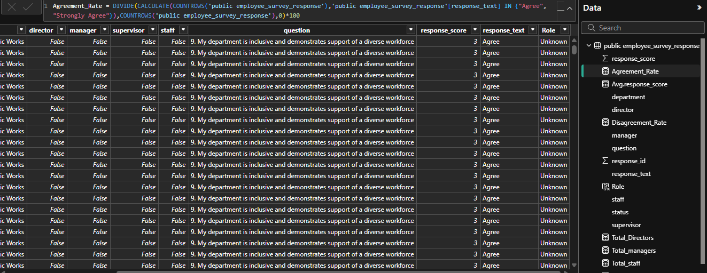

# Employee-Survey-Response-Analysis-Report-
Employee Survey Analysis using SQL and Power BI. Cleaned and transformed 14,725 survey responses, built an interactive dashboard, analyzed engagement by department and role, and delivered insights and recommendations to improve employee satisfaction.

## INTRODUCTION
Employee engagement is a key indicator of an organization's overall health, productivity and ability to retain talent. Organizations that regularly assess employee opinions can identify workplace strengths, address areas of concern and implement strategies that improve employee satisfaction and organizational performance. 

This project analyzes employee survey responses collected voluntarily from government employees of Pierce County, Washington. The survey consists of responses to ten employee engagement questions covering job satisfaction, leadership, recognition, career development, workplace relationships, accountability, diversity and organizational purpose.

Using SQL and Microsoft Power BI, the data was cleaned, transformed, analyzed and visualized to uncover meaningful insights that support data-driven decision-making.

### Project Objective 

Specifically, this project aims to:
- Measure the overall employee agreement and disagreement rate.
- Identify the survey questions with the highest and lowest rate of agreement.
- Compare employee engagement across departments and job roles.
- Identify patterns and trends influencing employee satisfaction.
- Provide actionable recommendations that can improve employee engagement and organizational performance.

### Importance of the Project 

Employee engagement directly impacts productivity, employee retention, organizational culture and service delivery. Understanding employees' perceptions enables management to make informed decisions that improve workplace conditions and foster a positive work environment. 

This analysis helps the organization to: 
- Understand employees' perceptions of the workplace.
- Identify strengths that should be maintained.
- Detect areas requiring management intervention.
- Support evidence-based decision-making.
- Improve employee satisfaction and organizational effectiveness.

## PROBLEM STATEMENT

Although employee engagement surveys provide valuable feedback, large datasets can make it difficult to identify meaningful trends without proper analysis.

Pierce County requires a data-driven approach to understand:
- Which aspects of the workplace employees value most.
- Areas where employees are dissatisfied.
- Whether engagement differs across departments and employee roles.
- What actions management can take to improve employee satisfaction.
  
Without proper analysis, important patterns and opportunities for improvement may remain hidden.

### Key Business Questions 

This analysis seeks to answer the following questions:
1. Which survey questions did employees agree with or disagree with the most?
2. Are there noticeable patterns or trends across departments and employee roles?
3. What actions can management take to improve employee satisfaction based on the survey findings?
4. Which departments demonstrate the highest and lowest employee engagement?
5. Which employee roles report the highest levels of satisfaction?
6. What organizational strengths should be maintained?
7. What factors may be contributing to lower employee satisfaction?

## SKILLS AND CONCEPTS DEMONSTRATED

This project demonstrates both technical and analytical skills.

#### SQL 
SQL was used for data preparation, including:
- Data cleaning
- Removing duplicate records
- Removing incomplete records
- Handling null values
- Standardizing inconsistent survey questions
- Data transformation
- Creating a clean dataset for analysis

#### Microsoft Power BI 

Power BI was used for:
- Creating calculated columns
- Writing DAX measures
- Calculating KPIs
- Calculating Agreement Rate
- Calculating Disagreement Rate
- Creating interactive visualizations
- Building an interactive dashboard
- Department analysis
- Role analysis
- Question-level analysis

## DATA OVERVIEW

The dataset contains employee engagement survey responses collected from Pierce County employees. 

                                                  
| Item | Description |
| :--- | :---: |
| Dataset Name |        Employees Survey Responses |
| Organisation  |                                      Pierce Country, Washington |
| Number of Records |                                       14,725 |
| Number of survey Questions  |                               10 |
|Number of Department  |                                      21 |
|Analysis Tool      |                                       SQL & PowerBI |

### Dataset Description

Each record in the dataset represents an employee's response to one survey question. 
The dataset captures employee opinions regarding: 

- Job expectations
- Job satisfaction
- Employee recognition
- Leadership support
- Career growth
- Accountability
- Workplace relationships
- Diversity and inclusion
- Organizational purpose

The survey responses were categorized into response options such as:
- Strongly Agree
- Agree
- Neutral
- Disagree
- Strongly Disagree

These responses were later grouped into Agreement and Disagreement categories during analysis.

### Dataset Variables
The dataset consists of the following key variables: 

| Variable | Description |
| :--- | :---: | 
| Response ID |  Unique identifier for each survey response |
| Status | Survey completion status |
| Department | Employee department |
| Director | Indicates whether the employee is a director |
| Manager | Indicates whether the employee is a manager |
| Supervisor | Indicates whether the employee is a supervisor |
| Staff | Indicates whether the employee is a staff member |
| Question | Survey question answered | 
| Response | Employee response category |
| Response Text | Numerical representation of the response |

### Data Quality Process 
#### Data Cleaning 
- Removed duplicate records using SQL.
- Removed incomplete survey responses.
- Standardized inconsistent question wording (e.g., replacing "&" with "and").
- Trimmed unnecessary spaces.
- Corrected formatting inconsistencies.
- Verified data types for each column.

#### Data Transformation 
- Created calculated columns in Power BI.
- Convert Boolean role indicators into meaningful categories.
- Created measures for Agreement Rate and Disagreement Rate.
- Calculated total responses and average response scores.
- Built KPIs for dashboard reporting.

## METHODOLOGY
### Data Collection 
The employee survey dataset was imported into PostgreSQL, after cleaning was imported into PowerBI for analysis

 ###  Data Cleaning
SQL was used to remove duplicates, filter incomplete records, standardize values, and prepare the data for analysis.

### Data Transformation 
Power BI DAX were used to create calculated new columns, measures and KPIs. 

### Data Analysis

The cleaned data was analyzed to answer the business questions by examining:
- Overall agreement levels
- Overall disagreement levels
- Employee roles
- Department performance
- Survey question performance

### Data Visualization
An interactive Power BI dashboard was developed using:
- KPI Cards
- Bar Charts
- Department Analysis
- Role Analysis
- Question Filters
- Insight and Recommendation Panels

  ### Survey Questions

1. I know what is expected of me at work.
2. At work, I have the opportunity to do what I do best every day.
3. In the last seven days, I have received recognition or praise for doing good work.
4. My supervisor or someone at work seems to care about me as a person.
5. The mission or purpose of my organization makes me feel my job is important.
6. I have a best friend at work.
7. This last year, I have had opportunities at work to learn and grow.
8. My supervisor holds employees accountable for performance.
9. My department is inclusive and demonstrates support for a diverse workforce.
10. Overall, I am satisfied with my job.

## DASHBOARD

## ANALYSIS AND FINDINGS

### Overall Employee Engagement 
 The survey results show that employees generally have a positive opinion about working in Pierce County. 

- Overall Agreement Rate: 75%
- Overall Disagreement Rate: 22%
- Average Response Score: 2.98

#### Key Insight
The overall agreement rate indicates that most employees have a positive perception of their workplace. However, the disagreement rate suggests that there are still important areas requiring management attention.

### Business Questions
### 1. Which survey questions did respondents agree with or disagree with the most?  
### Highest Agreement 
The survey questions with the highest agreement were: 

| Question |    Agreement Rate |
| :--- | :---: |
| 1. I know what is expected of me at work  | 92% |
| 4. My supervisor or someone at work cares about me as a person  | 86 % |
| 9.My department supports a diverse workforce  | 81% |
| 2.I have the opportunity to do what I do best every day | 80% |
| 5.The organization's mission makes me feel my job is important  | 80% | 

Insight:  The highest agreement was for "I know what is expected of me at work." This tells us that employees clearly understand their responsibilities and what is expected of them.

Many employees also believe that their supervisors care about them and that their work contributes to the organization's goals. This suggests that communication and leadership are working well.

#### Key Insight
Clear job expectations and supportive supervisors are major strengths of the organization. These are important because employees are more likely to perform well when they know what is expected and feel supported.

### Highest Disagreement 
The survey questions with the highest disagreement were: 

| Question |  Disagreement Rate |
| :--- | :---: |
| 6. I have a best friend at work | 42% |
| 3. I received recognition or praise in the last seven days  | 34% |
| 8. Overall, I am satisfied with my job | 24% |
| 10. My supervisor holds employees accountable  | 24% |
| 7. I had opportunities to learn and grow this last year | 22% |

Insight: The highest disagreement was for "I have a best friend at work." Although workplace friendships are not essential, this may suggest that employees have limited social connections or teamwork.

Another important finding is that many employees do not feel they receive enough recognition for their work. Some also believe they have limited opportunities to learn, grow, and develop their careers.

#### Key Insight
Employees want more appreciation for their work and better opportunities for career growth. Improving these areas could increase employee satisfaction and motivation.

### 2. Do you see any patterns or trends by department or role? 
### Role Analysis
The agreement rates by role were:
- Supervisor – 81%
- Manager – 79%
- Director – 79%
- Unknown – 74%
- Staff – 73%

Insignt : Although, the agreement rates are high across roles. But Supervisors reported the highest level of satisfaction, while Staff recorded the lowest.

This suggests that employees in leadership positions generally have a more positive experience than frontline employees.

#### Key Insight
The organization may need to pay more attention to the needs of staff members, as they appear to be less satisfied than employees in leadership roles.

### Department Analysis
Most departments recorded high agreement rates between 87 - 72% , with departments such as Emergency Management, Human Resources, and Family Justice Center performing particularly well.

However, the dashboard shows that the Sheriff's Department had only a 50% agreement rate which is the lowest.

#### Key Insight
Employee satisfaction is not the same across every department. Departments with lower satisfaction scores should be studied further to understand the specific issues affecting employees.

### 3. What steps can the organization take to improve employee satisfaction? 
The survey results suggest several areas where the organization can improve. 

Employees want:
- More recognition for the work they do.
- More opportunities to learn new skills and grow their careers.
- Better teamwork and stronger workplace relationships.
- Greater overall job satisfaction.

#### Key Insight
Small improvements in recognition, training, and employee development could have a big impact on employee engagement across the organization.

### ADDITIONAL INSIGHTS

1. Question 6 ("I have a best friend at work") recorded an agreement rate of 46% and a disagreement rate of 42%. The small difference between the agreement and disagreement rates shows that employees have mixed opinions about workplace relationships. 

#### Key Insight
This suggests that while some employees feel connected to their colleagues, a significant number do not. Although having a best friend at work is not essential for job performance, strong workplace relationships often improve teamwork, communication, collaboration, and employee engagement.

2. The Sheriff's Department recorded an agreement rate of only 36% for Question 10 ("Overall, I am satisfied with my job"), making it one of the lowest-performing departments. The department also recorded relatively low agreement rates in several other questions, including:
   
- Question 3 (Recognition): 26%
- Question 6 (Best friend at work): 31%
- Question 7 (Learning and growth): 39%
- Question 8 (Accountability): 46%
- Question 5 (Purpose of work): 48%
- Question 9 (Diversity and inclusion): 55%

Although the department scored higher in Question 4 (Supervisor cares about me as a person) with 62% agreement, overall engagement remains relatively low. 

#### Key Insight
The consistently low agreement across several survey questions suggest that the Sheriff's Department may be facing broader workplace challenges rather than a single isolated issue. Low scores in recognition, career development, teamwork, and overall job satisfaction indicate that employees may feel less supported and less engaged compared to employees in other departments.

## RECOMMENDATIONS

1. Implement a formal employee recognition program to acknowledge employee achievements and improve morale. 

2. Expand learning and development opportunities by offering training, mentorship and clear career progression pathways.

3. Conduct detailed investigations into lower-performing departments, such as the Sheriff's Department, to identify and address the root causes of dissatisfaction.

4. Strengthen team collaboration and workplace relationships through team-building activities and cross-departmental initiatives.

5. Increase engagement with frontline staff by involving them in decision-making processes, conducting regular feedback sessions, and addressing their specific workplace concerns. 

6. Maintain effective leadership practices by continuing to promote clear communication, supportive supervision, and accountability across all departments.

7. Monitor employee engagement regularly through periodic surveys and dashboard reporting to measure the impact of implemented initiatives and support continuous improvement.

8. Although having a best friend at work is not essential for job performance. But strong workplace relationships often improve teamwork, communication, collaboration and employee engagement.

9. Management should conduct a deeper review of the Sheriff's Department through employee interviews or follow-up surveys to identify the root causes of dissatisfaction.

10.  Based on the findings, targeted actions such as improving employee recognition, expanding professional development opportunities, strengthening communication  and reviewing workload or work processes should be implemented to improve employee satisfaction and engagement.

## CONCLUSION
The analysis shows that Pierce County has a generally positive work environment, with employees clearly understanding their roles and feeling supported by their supervisors.

 However, the findings highlight opportunities to improve employee recognition, career development, and satisfaction, particularly among staff and within the Sheriff's Department.

Addressing these areas through targeted initiatives will help strengthen employee engagement, improve workplace culture and support better organizational performance.

