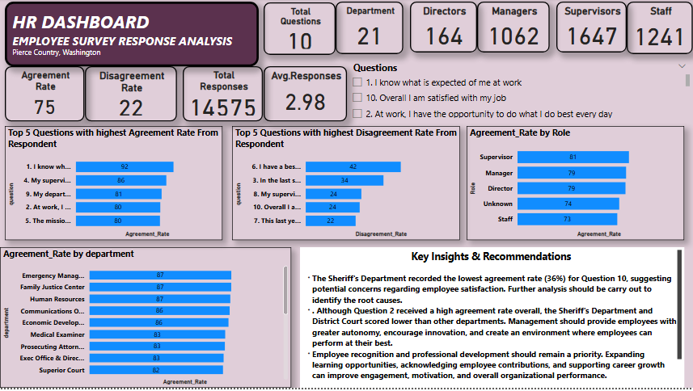

# Employee-Survey-Response-Analysis-Report-
Employee Survey Analysis using SQL and Power BI. Cleaned and transformed 14,725 survey responses, built an interactive dashboard, analyzed engagement by department and role, and delivered insights and recommendations to improve employee satisfaction.

## INTRODUCTION
Employee engagement is a key indicator of an organization's overall health, productivity and ability to retain talent. Organizations that regularly assess employee opinions can identify workplace strengths, address areas of concern and implement strategies that improve employee satisfaction and organizational performance. 
