# Employee-Survey-Response-Analysis-Report-
Employee Survey Analysis using SQL and Power BI. Cleaned and transformed 14,725 survey responses, built an interactive dashboard, analyzed engagement by department and role, and delivered insights and recommendations to improve employee satisfaction.

## INTRODUCTION
Employee engagement is a key indicator of an organization's overall health, productivity and ability to retain talent. Organizations that regularly assess employee opinions can identify workplace strengths, address areas of concern and implement strategies that improve employee satisfaction and organizational performance. 

This project analyzes employee survey responses collected voluntarily from government employees of Pierce County, Washington. The survey consists of responses to ten employee engagement questions covering job satisfaction, leadership, recognition, career development, workplace relationships, accountability, diversity and organizational purpose.

Using SQL and Microsoft Power BI, the data was cleaned, transformed, analyzed and visualized to uncover meaningful insights that support data-driven decision-making.

### Project Objective 

Specifically, this project aims to:
- Measure the overall employee agreement and disagreement rate.
- Identify the survey questions with the highest and lowest rate of agreement.
- Compare employee engagement across departments and job roles.
- Identify patterns and trends influencing employee satisfaction.
- Provide actionable recommendations that can improve employee engagement and organizational performance.

### Importance of the Project 

Employee engagement directly impacts productivity, employee retention, organizational culture and service delivery. Understanding employees' perceptions enables management to make informed decisions that improve workplace conditions and foster a positive work environment. 

This analysis helps the organization to: 
- Understand employees' perceptions of the workplace.
- Identify strengths that should be maintained.
- Detect areas requiring management intervention.
- Support evidence-based decision-making.
- Improve employee satisfaction and organizational effectiveness.

## PROBLEM STATEMENT

Although employee engagement surveys provide valuable feedback, large datasets can make it difficult to identify meaningful trends without proper analysis.

Pierce County requires a data-driven approach to understand:
- Which aspects of the workplace employees value most.
- Areas where employees are dissatisfied.
- Whether engagement differs across departments and employee roles.
- What actions management can take to improve employee satisfaction.
  
Without proper analysis, important patterns and opportunities for improvement may remain hidden.

### Key Business Questions 

This analysis seeks to answer the following questions:
1. Which survey questions did employees agree with or disagree with the most?
2. Are there noticeable patterns or trends across departments and employee roles?
3. What actions can management take to improve employee satisfaction based on the survey findings?
4. Which departments demonstrate the highest and lowest employee engagement?
5. Which employee roles report the highest levels of satisfaction?
6. What organizational strengths should be maintained?
7. What factors may be contributing to lower employee satisfaction?

## SKILLS AND CONCEPTS DEMONSTRATED

This project demonstrates both technical and analytical skills.

#### SQL 
SQL was used for data preparation, including:
- Data cleaning
- Removing duplicate records
- Removing incomplete records
- Handling null values
- Standardizing inconsistent survey questions
- Data transformation
- Creating a clean dataset for analysis

#### Microsoft Power BI 

Power BI was used for:
- Creating calculated columns
- Writing DAX measures
- Calculating KPIs
- Calculating Agreement Rate
- Calculating Disagreement Rate
- Creating interactive visualizations
- Building an interactive dashboard
- Department analysis
- Role analysis
- Question-level analysis

## DATA OVERVIEW

The dataset contains employee engagement survey responses collected from Pierce County employees. 

Item                                                     

- Dataset Name :         Employees Survey Responses
- Organisation   :                                        Pierce Country, Washington
- Number of Records :                                        14,725
- Number of survey Questions  :                                10
- Number of Department  :                                       21
- Analysis Tool      :                                       SQL & PowerBI

### Dataset Description

Each record in the dataset represents an employee's response to one survey question. 
The dataset captures employee opinions regarding: 

- Job expectations
- Job satisfaction
- Employee recognition
- Leadership support
- Career growth
- Accountability
- Workplace relationships
- Diversity and inclusion
- Organizational purpose

The survey responses were categorized into response options such as:
- Strongly Agree
- Agree
- Neutral
- Disagree
- Strongly Disagree

These responses were later grouped into Agreement and Disagreement categories during analysis.

### Dataset Variables
The dataset consists of the following key variables: 

- Response ID :  Unique identifier for each survey response 
- Status : Survey completion status
- Department : Employee department
- Director : Indicates whether the employee is a director 
- Manager : Indicates whether the employee is a manager
- Supervisor : Indicates whether the employee is a supervisor 
- Staff : Indicates whether the employee is a staff member 
- Question : Survey question answered 
- Response : Employee response category 
- Response Text : Numerical representation of the response 

### Data Quality Process 
#### Data Cleaning 
- Removed duplicate records using SQL.
- Removed incomplete survey responses.
- Standardized inconsistent question wording (e.g., replacing "&" with "and").
- Trimmed unnecessary spaces.
- Corrected formatting inconsistencies.
- Verified data types for each column.

#### Data Transformation 
- Created calculated columns in Power BI.
- Convert Boolean role indicators into meaningful categories.
- Created measures for Agreement Rate and Disagreement Rate.
- Calculated total responses and average response scores.
- Built KPIs for dashboard reporting.

## METHODOLOGY
### Data Collection 
The employee survey dataset was imported into PostgreSQL, after cleaning was imported into PowerBI for analysis

 ###  Data Cleaning
SQL was used to remove duplicates, filter incomplete records, standardize values, and prepare the data for analysis.

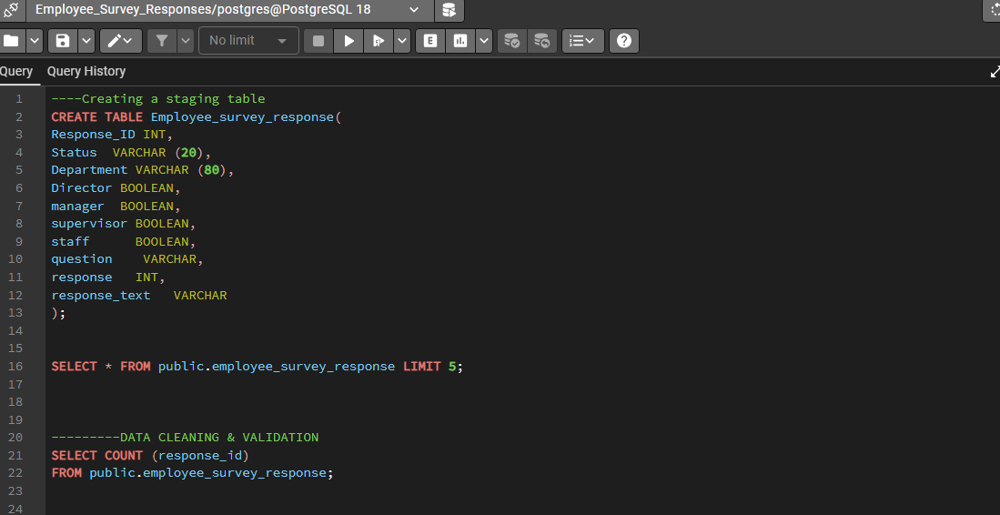

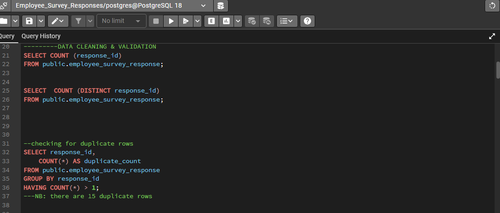

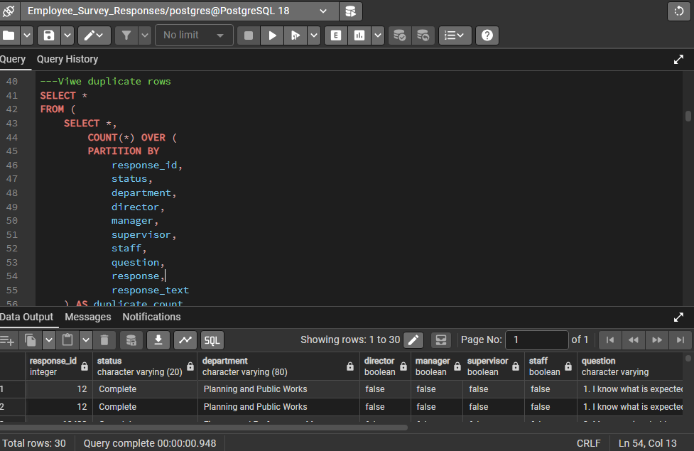

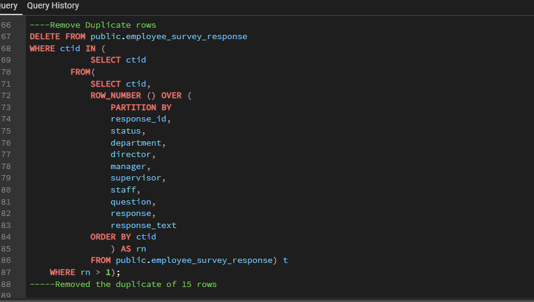

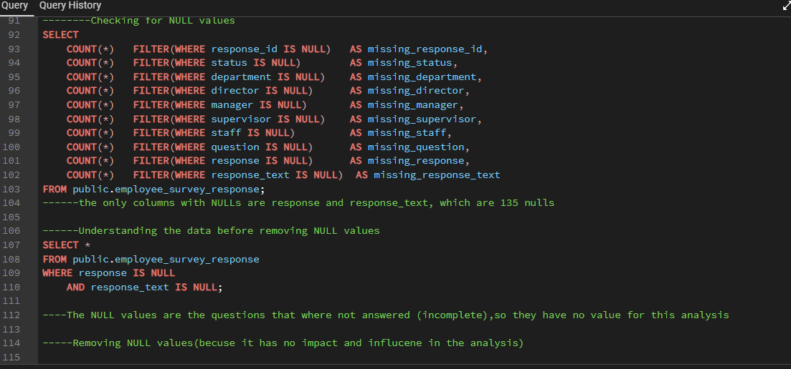

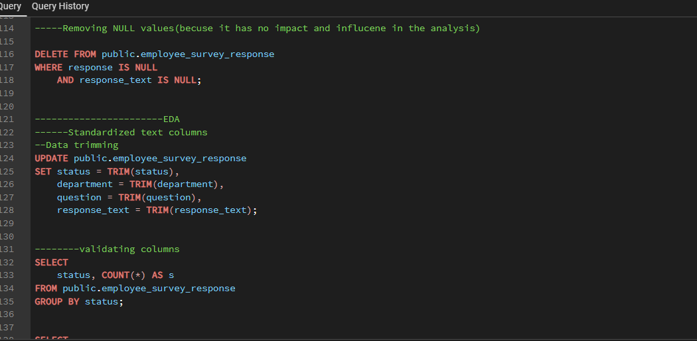

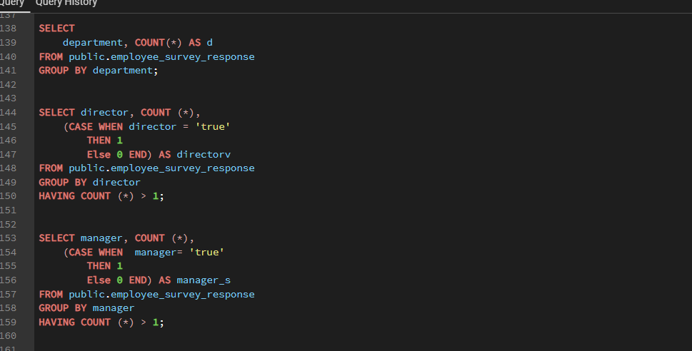

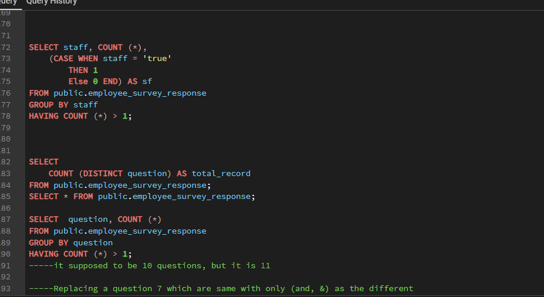

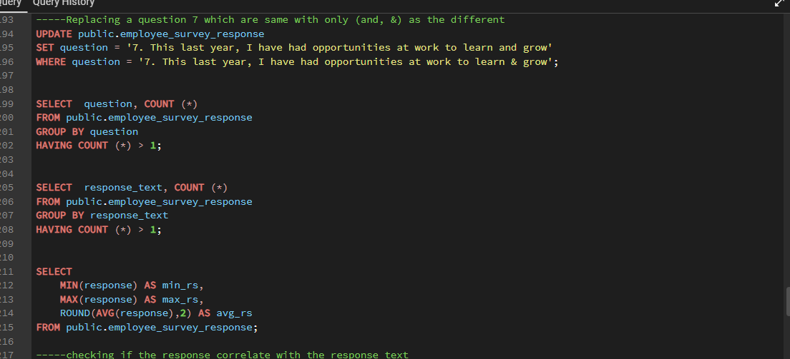

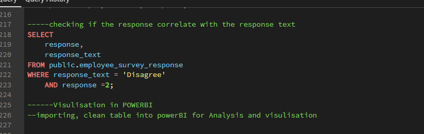

### Data Transformation 
Power BI DAX were used to create calculated new columns, measures and KPIs. 

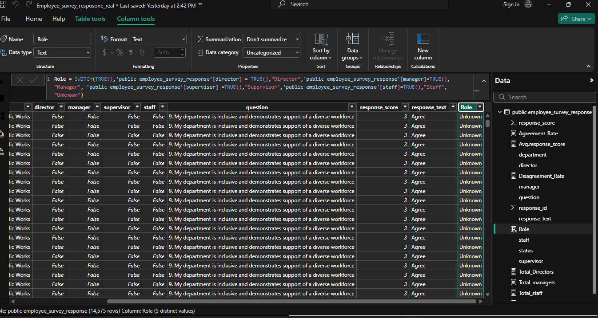

